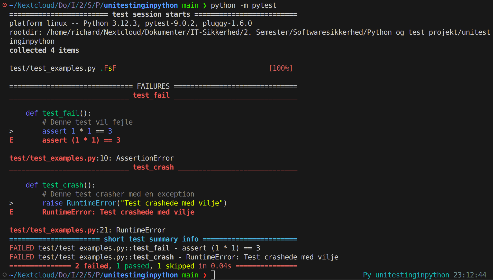
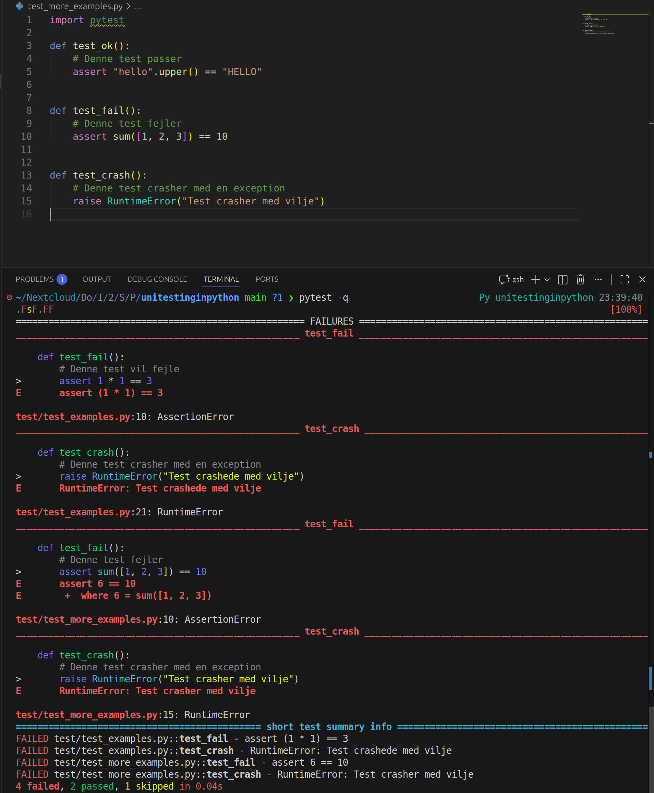

# Zealand

### Hvad jeg forventer at lære på Softwaresikkerhed
Jeg forventer at lære, hvordan programkvalitet, fejlhåndtering og sikkerhedsdesign, herunder security by design og privacy by design, bruges til at identificere, forebygge og vurdere sårbarheder i programkode og softwarearkitektur samt arbejde med risikovurdering og grundlæggende kryptering.

### Billede af Python test

### Billede hvor jeg har tilføjet 3 tests.

# Testteknikker i IT-sikkerhed

## Valgt emne: Login-system

Et login-system hvor brugeren indtaster brugernavn og password. Systemet skal håndtere validering, fejlede forsøg og kontolåsning.

---

## Ækvivalensklasser

| Klasse | Eksempel |
|--------|----------|
| Gyldigt brugernavn | `lars@firma.dk` |
| Ugyldigt brugernavn (tomt) | `` |
| Ugyldigt brugernavn (findes ikke) | `ikkeeksisterende@firma.dk` |
| Gyldigt password | `Hemlig123!` |
| Ugyldigt password (forkert) | `forkertpassword` |

---

## Grænseværditest

Kontoen låses efter 3 fejlede loginforsøg:

| Antal fejlede forsøg | Forventet resultat |
|---------------------|-------------------|
| 2 | Adgang nægtet, konto åben |
| 3 | Adgang nægtet, konto låses |
| 4 | Adgang nægtet, konto forbliver låst |

---

## CRUD(L)

| Operation | Test |
|-----------|------|
| **Create** | Opret ny bruger med brugernavn og password |
| **Read** | Hent brugeroplysninger (uden at vise password) |
| **Update** | Skift password for en bruger |
| **Delete** | Slet en bruger fra systemet |
| **List** | Vis alle brugere (kun for admin) |

---

## Cycle Process Test

- Bruger logger ind og ud 100 gange i træk
- Verificér at session håndteres korrekt hver gang
- Ingen memory leaks eller akkumulerede fejl

---

## Test Pyramiden

| Niveau | Eksempel |
|--------|----------|
| Unit test | Validér at password-hashing virker |
| Integration test | Test login mod database |
| E2E test | Fuld brugerrejse: login → se data → logout |

---

## Decision Table Test

| Brugernavn findes | Password korrekt | Konto låst | Resultat |
|-------------------|-----------------|-----------|----------|
| Ja | Ja | Nej | Adgang |
| Ja | Ja | Ja | Afvist |
| Ja | Nej | Nej | Afvist + tæl forsøg |
| Nej | – | – | Afvist |

---

## Security Gates

| Testteknik | Security Gate |
|------------|---------------|
| Ækvivalensklasser | Code/Dev gate |
| Grænseværditest | Code/Dev gate |
| CRUD(L) | Integration gate |
| Cycle process test | Release candidate gate |
| Test pyramiden | Alle gates |
| Decision table test | Code/Dev gate |