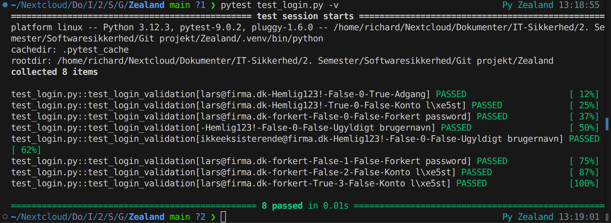
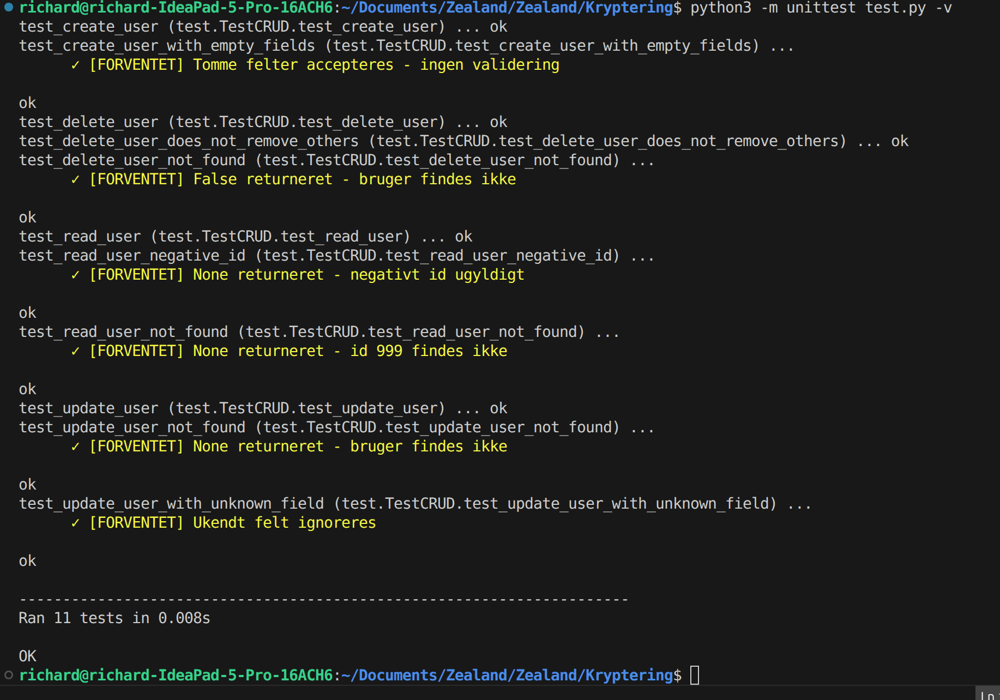

# Zealand

### Hvad jeg forventer at lære på Softwaresikkerhed
Jeg forventer at lære, hvordan programkvalitet, fejlhåndtering og sikkerhedsdesign, herunder security by design og privacy by design, bruges til at identificere, forebygge og vurdere sårbarheder i programkode og softwarearkitektur samt arbejde med risikovurdering og grundlæggende kryptering.


### Billede af Python test


### Billede hvor jeg har tilføjet 3 tests.


# Testteknikker i IT-sikkerhed

## Valgt emne: Login-system

Et login-system hvor brugeren indtaster brugernavn og password. Systemet skal håndtere validering, fejlede forsøg og kontolåsning.

---

## Ækvivalensklasser

| Klasse | Eksempel |
|--------|----------|
| Gyldigt brugernavn | `lars@firma.dk` |
| Ugyldigt brugernavn (tomt) | `` |
| Ugyldigt brugernavn (findes ikke) | `ikkeeksisterende@firma.dk` |
| Gyldigt password | `Hemlig123!` |
| Ugyldigt password (forkert) | `forkertpassword` |

---

## Grænseværditest

Kontoen låses efter 3 fejlede loginforsøg:

| Antal fejlede forsøg | Forventet resultat |
|---------------------|-------------------|
| 2 | Adgang nægtet, konto åben |
| 3 | Adgang nægtet, konto låses |
| 4 | Adgang nægtet, konto forbliver låst |

---

## CRUD(L)

| Operation | Test |
|-----------|------|
| **Create** | Opret ny bruger med brugernavn og password |
| **Read** | Hent brugeroplysninger (uden at vise password) |
| **Update** | Skift password for en bruger |
| **Delete** | Slet en bruger fra systemet |
| **List** | Vis alle brugere (kun for admin) |

---

## Cycle Process Test

- Bruger logger ind og ud 100 gange i træk
- Verificér at session håndteres korrekt hver gang
- Ingen memory leaks eller akkumulerede fejl

---

## Test Pyramiden

| Niveau | Eksempel |
|--------|----------|
| Unit test | Validér at password-hashing virker |
| Integration test | Test login mod database |
| E2E test | Fuld brugerrejse: login → se data → logout |

---

## Decision Table Test

| Brugernavn findes | Password korrekt | Konto låst | Resultat |
|-------------------|-----------------|-----------|----------|
| Ja | Ja | Nej | Adgang |
| Ja | Ja | Ja | Afvist |
| Ja | Nej | Nej | Afvist + tæl forsøg |
| Nej | – | – | Afvist |

---

## Security Gates

| Testteknik | Security Gate |
|------------|---------------|
| Ækvivalensklasser | Code/Dev gate |
| Grænseværditest | Code/Dev gate |
| CRUD(L) | Integration gate |
| Cycle process test | Release candidate gate |
| Test pyramiden | Alle gates |
| Decision table test | Code/Dev gate |


## PyTest (Leg)

Data-dreven unit test der kombinerer Decision Table Test og Grænseværditest.

Testen bruger `@pytest.mark.parametrize` til at køre samme testfunktion med forskellige input-data. Hver række i parametrene repræsenterer et testscenarie fra vores Decision Table (kombinationer af brugernavn, password, kontostatus) og Grænseværditest (antal fejlede loginforsøg ved grænsen på 3).

Se filen: [test_login.py](test_login.py)

**Test resultat:**




# Kryptering

## Hvorfor er det smart at bruge en flat file database?

En flat file database er en simpel måde at gemme data på, hvor alt ligger i én fil (f.eks. JSON). Det er smart fordi:

- **Simpelt setup** – ingen installation af databasesoftware som MySQL eller PostgreSQL. Man skal bare have en JSON-fil.
- **Let at forstå** – dataen er menneskelæsbar. Man kan åbne filen og se alt dataen direkte.
- **Portabelt** – hele databasen er én fil, som nemt kan kopieres, deles eller flyttes.
- **Ingen afhængigheder** – kræver ikke en databaseserver der kører i baggrunden.
- **Godt til små projekter** – perfekt til prototyper, tests og mindre applikationer.

### Ulemper

- Skalerer ikke godt til store datamængder.
- Ingen avanceret søgning eller filtrering som SQL.
- Risiko for datatab hvis flere processer skriver til filen samtidig.

---

## Unit Tests

Testene er skrevet med Pythons `unittest` modul og tester alle CRUD-operationer (Create, Read, Update, Delete) samt edge cases.

### Test resultater


> – Screenshot af terminal output fra `python3 -m unittest test.py -v`

---

### Gode test navne

Alle tests er navngivet beskrivende, så man kan se hvad de tester:

| Test navn | Beskrivelse |
|---|---|
| `test_create_user` | Tester at en bruger kan oprettes |
| `test_create_user_with_empty_fields` | Tester oprettelse med tomme felter |
| `test_read_user` | Tester at en bruger kan hentes |
| `test_read_user_not_found` | Tester opslag med ugyldigt id |
| `test_read_user_negative_id` | Tester opslag med negativt id |
| `test_update_user` | Tester at en bruger kan opdateres |
| `test_update_user_not_found` | Tester opdatering af bruger der ikke findes |
| `test_update_user_with_unknown_field` | Tester opdatering med ukendt felt |
| `test_delete_user` | Tester at en bruger kan slettes |
| `test_delete_user_not_found` | Tester sletning af bruger der ikke findes |
| `test_delete_user_does_not_remove_others` | Tester at sletning ikke påvirker andre |

---

### Risikokommentarer

Hver test har en kort kommentar der beskriver risikoen hvis testen ikke består. Eksempler:

```python
# Risiko: Brugere kan ikke oprettes i systemet.
def test_create_user(self):

# Risiko: Systemet crasher ved opslag på id der ikke findes.
def test_read_user_not_found(self):

# Risiko: Ukendte felter kan tilføjes til brugerobjektet.
def test_update_user_with_unknown_field(self):
```


---

### Given, When, Then

Alle test cases følger Given-When-Then mønsteret som kommentarer:

```python
def test_create_user(self):
    # Given: En tom database
    # When: En bruger oprettes
    user = create_user("Anders", "Jensen", "Hovedgaden", "12A", "hemmelig123")
    # Then: Brugeren returneres med korrekte data
    self.assertEqual(user["first_name"], "Anders")
```

---

## Kryptering og Hashing

### Hvilke algoritmer havde jeg at vælge imellem?

**Kryptering (til persondata):**

| Algoritme | Type | Beskrivelse |
|---|---|---|
| AES (Fernet) | Symmetrisk | Samme nøgle til kryptering og dekryptering. Hurtig og sikker. |
| RSA | Asymmetrisk | To nøgler (offentlig + privat). Langsommere, bruges typisk til kommunikation. |
| ChaCha20 | Symmetrisk | Alternativ til AES. Hurtig på enheder uden hardware-AES support. |

**Jeg valgte Fernet (AES)** fordi det er simpelt at bruge, sikkert nok til vores formål, og det er en symmetrisk algoritme – vi har kun brug for én nøgle, da det er den samme applikation der både krypterer og dekrypterer.

**Hashing (til passwords):**

| Algoritme | Beskrivelse |
|---|---|
| SHA-256 | Hurtig hash-funktion. Producerer et unikt 64-tegn hex-hash. |
| bcrypt | Langsom hash designet til passwords. Inkluderer salt automatisk. |
| Argon2 | Nyere password-hash. Vinder af Password Hashing Competition. |

**Jeg valgte SHA-256** fordi det er simpelt og indbygget i Python (`hashlib`). I et produktionsmiljø ville bcrypt eller Argon2 være bedre valg, da de er designet til at være langsomme og dermed sværere at brute-force.

---

### Hvornår og hvorfor krypterer jeg data?

Data krypteres **når den gemmes** i JSON-filen (`create_user` og `update_user`). Det gøres fordi:

- GDPR kræver at persondata beskyttes. Hvis nogen får adgang til JSON-filen, kan de ikke læse persondata som navne og adresser.
- Kun applikationen med den korrekte nøgle (`secret.key`) kan læse dataen.

Felter der krypteres: `first_name`, `last_name`, `address`, `street_number`.

Passwords krypteres **ikke** – de **hashes** i stedet, fordi vi aldrig har brug for at se det originale password.

---

### Hvornår og hvorfor dekrypterer jeg data?

Data dekrypteres **når den læses** fra JSON-filen (`get_user` og `get_all_users`). Det gøres fordi:

- Applikationen har brug for at vise brugerdata i klartekst til autoriserede brugere.
- Dekryptering sker kun i hukommelsen – den dekrypterede data skrives aldrig tilbage til filen.

---

### Hvornår og hvorfor fjerner jeg dekrypteret data fra hukommelsen?

Dekrypteret data fjernes fra hukommelsen **så snart den ikke længere er i brug**. I Python sker dette automatisk via garbage collection, når variablen går ud af scope (f.eks. når en funktion returnerer).

Det er vigtigt fordi:

- Dekrypteret persondata i hukommelsen er sårbar. Hvis en angriber har adgang til serverens RAM, kan de læse dataen.
- Jo kortere tid data ligger dekrypteret i hukommelsen, jo mindre er risikoen for datalæk.

---

### Bør man tage hensyn til noget andet?

- **Nøgleopbevaring** – `secret.key` filen bør opbevares sikkert og aldrig committes til Git. Den bør tilføjes til `.gitignore`.
- **Salt på passwords** – SHA-256 uden salt er sårbar over for rainbow table-angreb. I produktion bør man bruge bcrypt eller Argon2 der automatisk tilføjer salt.
- **Backup af nøgle** – hvis `secret.key` går tabt, kan al krypteret data ikke dekrypteres. Der bør være en sikker backup.
- **HTTPS** – data bør transporteres krypteret over netværket, så det ikke kan opfanges undervejs.
- **Adgangskontrol** – ikke alle brugere bør kunne se al data. Der bør implementeres roller og rettigheder.